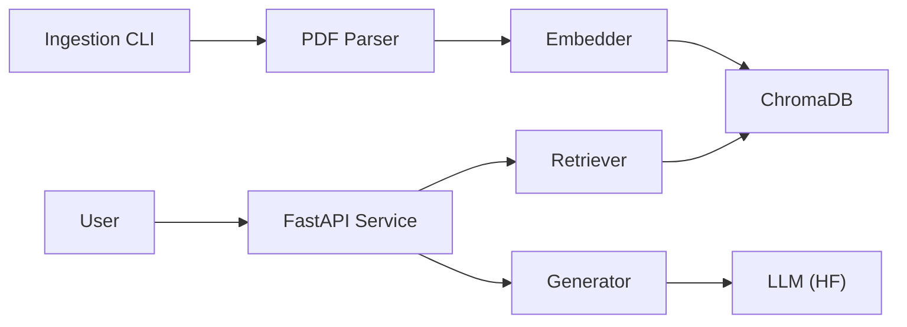

# Building a Production-Ready LLM Chatbot: Beyond the "Hello World"

*By [Your Name]*

---

## The "Notebook Trap"

We’ve all been there. You fire up a Jupyter Notebook, import LangChain, load a PDF, and five minutes later, you’re chatting with your document. It feels like magic. You think, "I could build a startup with this!"

But then you try to deploy it.

Suddenly, that 10-line script isn't enough. You need an API. You need to handle multiple users. You need to monitor performance. And you need to make sure it doesn't hallucinate or leak data.

I recently went through this journey, taking a simple RAG (Retrieval-Augmented Generation) concept and turning it into a production-ready MLOps project. Here is exactly how I built it, the architectural decisions I made, and—crucially—the security layers I wish I had implemented from day one.

## The Architecture

I didn't want a monolith. I wanted a system that could scale the ingestion pipeline independently from the query service.

Here is the high-level architecture I landed on:



The system is split into two distinct parts:
1.  **Ingestion Pipeline**: A CLI tool that parses, cleans, chunks, and embeds documents into ChromaDB.
2.  **RAG Service**: A FastAPI application that handles user queries, retrieves context, and generates answers.

## The Build: A Technical Deep Dive

### 1. The Ingestion Pipeline

Ingestion is often overlooked, but garbage in equals garbage out. I built a robust CLI that handles the entire lifecycle of a document.

Here is the core logic from `ingest/cli.py`. Notice how I separated the concerns:

```python
# ingest/cli.py

def main():
    # ... argument parsing ...

    logger.info(f"Parsing {file_path}...")
    pdf_parser = PDFParser()
    documents = pdf_parser.parse(file_path)
    
    logger.info("Cleaning text...")
    cleaner = TextCleaner()
    for doc in documents:
        doc["text"] = cleaner.clean(doc["text"])

    logger.info("Splitting text...")
    splitter = TextSplitter()
    chunked_docs = splitter.split(documents)
    
    logger.info("Generating embeddings...")
    embedder = EmbeddingGenerator()
    texts = [doc["text"] for doc in chunked_docs]
    embeddings = embedder.embed_documents(texts)
    
    logger.info("Indexing into ChromaDB...")
    indexer = ChromaIndexer(host=args.chroma_host, port=args.chroma_port)
    indexer.index_documents(chunked_docs, embeddings)
```

By modularizing `PDFParser`, `TextCleaner`, and `TextSplitter`, I can easily swap out the OCR engine or change the chunking strategy without rewriting the whole script.

### 2. The Retrieval Engine

For the serving layer, I used FastAPI for its speed and automatic documentation. The heart of the system is the `Retriever` class. It doesn't just "search"; it embeds the user's query on the fly and finds the nearest neighbors in the vector space.

```python
# service/rag/retriever.py

class Retriever:
    def __init__(self, host: str = "localhost", port: int = 8000, collection_name: str = "documents"):
        self.client = chromadb.HttpClient(host=host, port=port)
        self.collection = self.client.get_collection(name=collection_name)
        self.embedder = EmbeddingGenerator()

    def retrieve(self, query: str, k: int = 5) -> List[Dict]:
        query_embedding = self.embedder.embed_query(query)
        
        results = self.collection.query(
            query_embeddings=[query_embedding],
            n_results=k
        )
        
        # ... formatting results ...
                
        return documents
```

This separation allows me to scale the API containers horizontally while keeping the vector database centralized.

## The Elephant in the Room: AI Security

I’ll be honest—in the rush to get this working, security was a "Phase 2" problem. But in the world of LLMs, security cannot be an afterthought.

If I were to rebuild this today, here is how I would incorporate **Privacy by Design** and **AI Security Principles** into every layer:

### 1. Input Guardrails (The First Line of Defense)
Right now, the API accepts any string. This is a recipe for Prompt Injection.
*   **Fix**: Implement a "NeMo Guardrails" or similar layer before the `Retriever`. This would scan for jailbreak attempts (e.g., "Ignore previous instructions") and block them before they even reach the embedding model.

### 2. PII Redaction (Privacy by Design)
I am currently embedding raw text from PDFs. If a document contains a social security number or email address, it goes straight into the vector DB.
*   **Fix**: Add a PII (Personally Identifiable Information) scrubber in the `TextCleaner` step. Using libraries like Microsoft Presidio, we can detect and redact sensitive entities *before* embedding.

### 3. Role-Based Access Control (RBAC)
Currently, anyone who can hit the API can query *all* documents.
*   **Fix**: Implement document-level metadata filtering in ChromaDB. When a user queries, we should pass a filter like `where={"department": "HR"}` to ensure they only see what they are authorized to see.

## Conclusion

Building a demo is easy. Building a system is hard.

This project taught me that MLOps isn't just about training models; it's about the glue that holds the system together—the pipelines, the APIs, and the observability. And while I’m proud of the architecture, the next iteration will be laser-focused on security.

Because in the age of AI, trust is the most important feature you can build.
